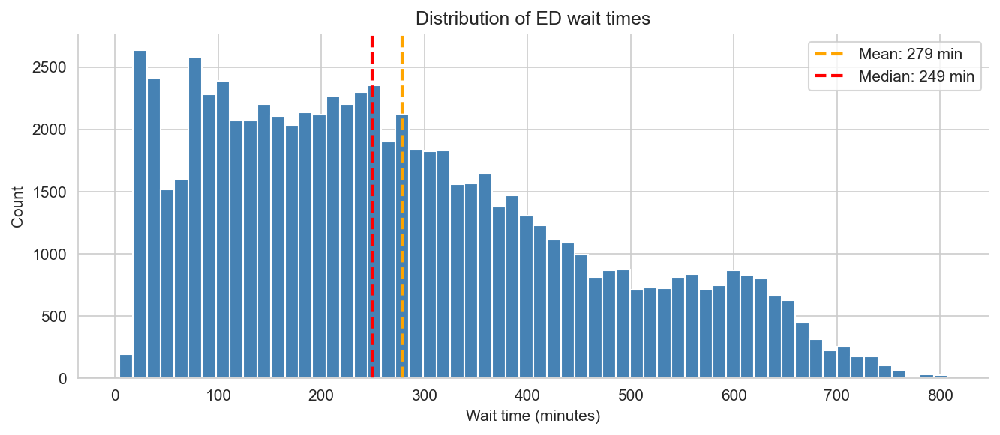
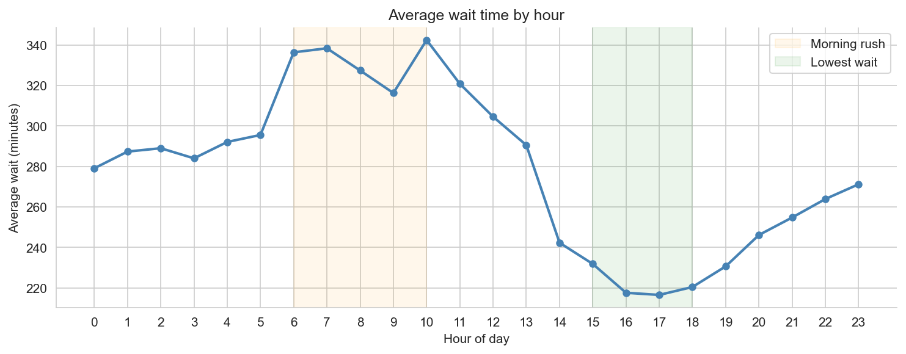
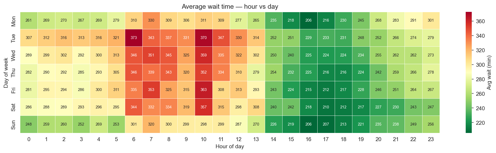
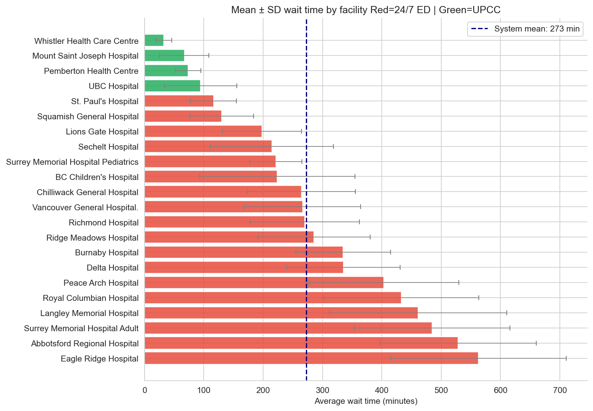
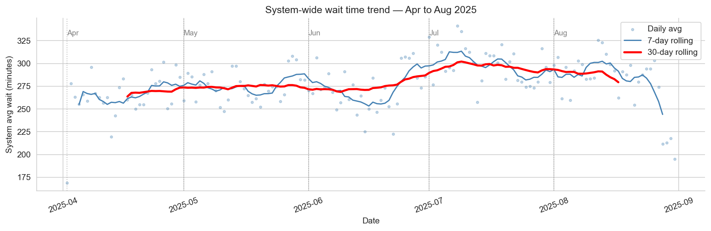
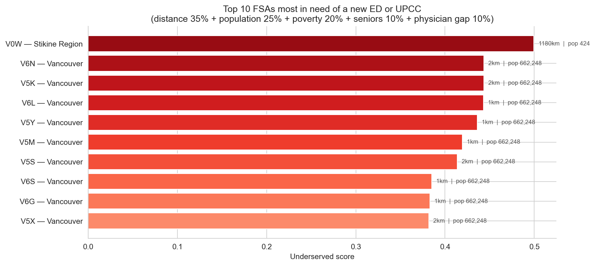
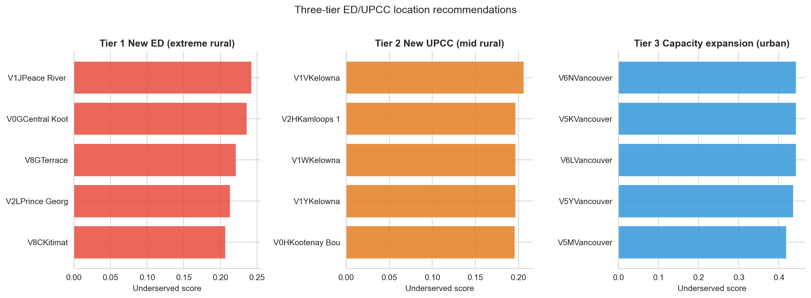
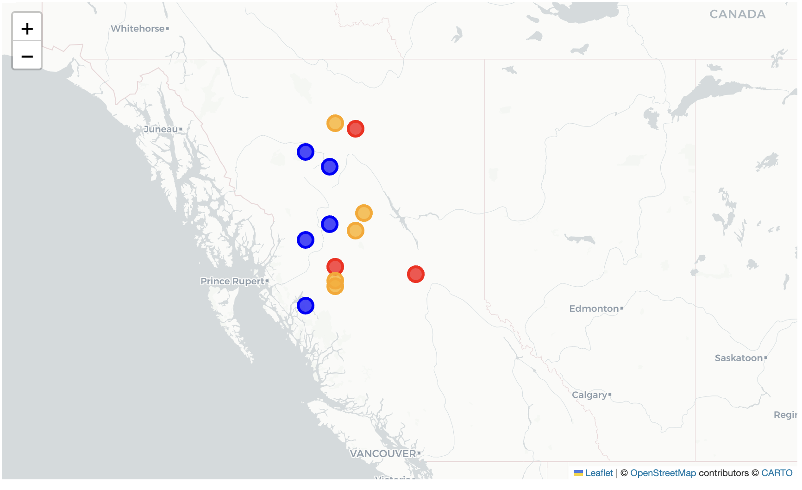

# Healthcare ED Accessibility BC

Predicting ED/UPCC wait times and identifying underserved communities
across British Columbia using machine learning, data engineering, and
cloud platforms.


## The Problem

- ED patients leaving without care increased **85%** from 2018–2024
- **6.5 million** Canadians have no regular care provider
- No new ED has opened in Vancouver since 2010

---
## Research Questions

| Question                                   | Approach |
|--------------------------------------------|---|
| Q1: How well can we predict ED wait times? | XGBoost regression on 75,855 hourly records |
| Q2: Where should the next ED open?         | Composite underserved scoring across 191 BC FSAs 

## Key Results

**Q1 — Wait time prediction:**
- Best model: XGBoost — MAE = 26.0 min, R² = 0.949
- 8.8% improvement over naive baseline
- Trained on Apr–Aug 2025 hourly data across 22 facilities

**Q2 — Location recommendation:**
- Prince George (V2L): 76,000 people, 392km from nearest ED
- Three-tier recommendation: new ED vs new UPCC vs capacity expansion
- Sensitivity analysis across 5 policy scenarios confirms robust sites

---


## Visualisations

### Wait Time Distribution


### Wait Time by Hour of Day


### Wait time peaks Tuesday–Thursday mornings


### 17× difference in wait times across facilities


### System-wide wait time trend — July is worst month



### Top 10 most underserved FSAs in BC


### Three-tier ED/UPCC location recommendations


### Interactive Map — Underserved Communities Across BC
> Click the link below to explore underserved BC communities on an interactive map

[View Interactive Map](results/q3_recommendations_map.html)


## Cloud Architecture

**Pipeline flow:**

1. Raw CSVs → Data Validation (15 quality checks)
2. ETL Pipeline → cleans and transforms data
3. Azure Blob Storage → stores processed CSVs in cloud
4. Azure Function → auto-triggers on new data uploads
5. ML Models → read directly from Azure
6. Results → charts and interactive map


## Project Structure
Built on **Microsoft Azure** — Blob Storage + Azure Functions.

```
healthcare-ed-accessibility-bc/
├── data/
│   ├── raw/              (original datasets - not in git)
│   └── processed/        (ETL outputs - not in git)
├── 01_eda_wait_times.ipynb
├── 02_eda_location.ipynb
├── 03_ED_WaitTime_Predictions.ipynb
├── 04_q3_location_modelling.ipynb
│    
├── src/pipelines/
│   ├── etl.py
│   └── validate.py
├── cloud/
│   ├── upload_data.py
│   ├── download_data.py
│   └── azure_function.py
├── requirements.txt
└── README.md
```


## How to Run

**1. Clone the repo:**
```bash
git clone https://github.com/26-Lav/healthcare-ed-accessibility-bc.git
cd healthcare-ed-accessibility-bc
```

**2. Set up environment:**
```bash
python -m venv .venv
source .venv/bin/activate
pip install -r requirements.txt
```

**3. Add your Azure credentials:**
Create a `.env` file:
AZURE_CONNECTION_STRING=your_connection_string
AZURE_CONTAINER_NAME=healthcare-ed-data
AZURE_STORAGE_ACCOUNT=healthcaredatabc

**4. Run the pipeline:**
```bash
python src/pipelines/validate.py
python src/pipelines/etl.py
python cloud/upload_data.py
```

**5. Run the notebooks** in order:
- `01_eda_wait_times.ipynb`
- `02_eda_location.ipynb`
- `03_ED_WaitTime_Predictions.ipynb`
- `04_q3_location_modelling.ipynb`

---

## Datasets

| Dataset | Description |
|---|---|
| EDWaitTimes.csv | Hourly wait times, 22 facilities, Apr–Aug 2025 |
| census_filtered.csv | 2021 Census at CSD level for BC |
| CPSBC Family Physicians.csv | Physician counts by postal code |
| fsa_nearest_ed.csv | Distance from each FSA to nearest ED |
| fsa_to_ed_distances_long.csv | Full FSA × ED distance matrix |

---

## Tech Stack

- **Python 3.11** — pandas, scikit-learn, XGBoost, folium
- **Microsoft Azure** — Blob Storage, Azure Functions
- **Jupyter** — EDA and modelling notebooks
- **GitHub** — version control and project hosting

---

## Authors

Built by Lavika Singh — SFU Data Science